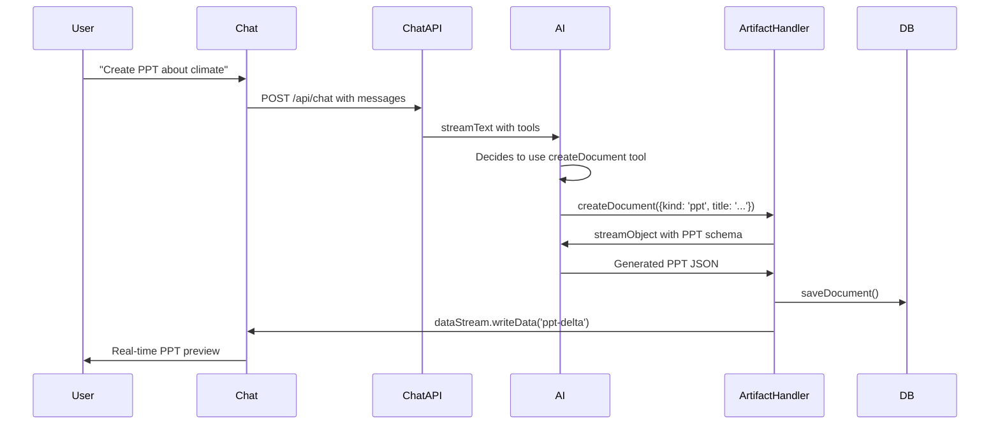
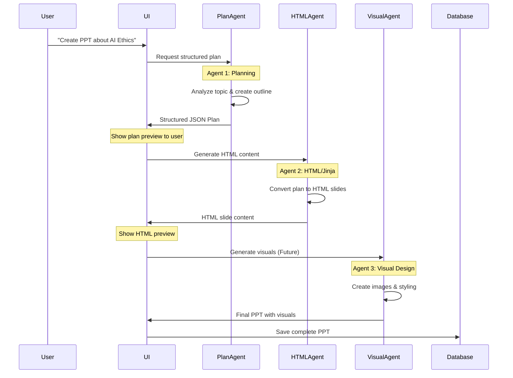
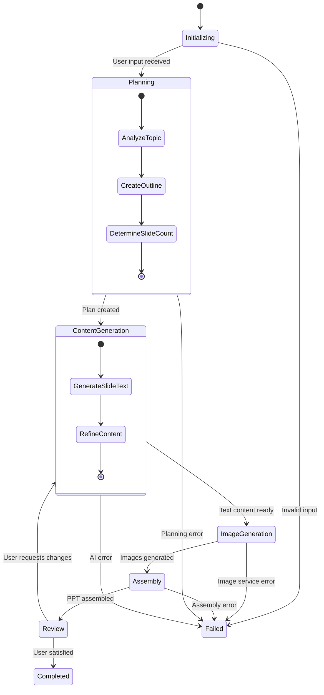

# AI Chatbot Architecture Visualization

## Current System Architecture

```mermaid
graph TB
    subgraph "Frontend Layer"
        UI[Next.js UI Components]
        Chat[Chat Interface]
        Artifacts[Artifact Viewers]
        Auth[Auth Pages]
    end
    
    subgraph "API Layer"
        ChatAPI[/api/chat - Streaming]
        DocAPI[/api/document]
        AuthAPI[/api/auth/*]
        FileAPI[/api/files/upload]
        CreditAPI[/api/user/credits]
        PPTAPI[/api/generate-pptx]
    end
    
    subgraph "AI Processing"
        AIProvider[AI Provider - Gemini/OpenRouter]
        Tools[AI Tools]
        Streaming[AI SDK Streaming]
        ArtifactGen[Artifact Generation]
    end
    
    subgraph "Database Layer"
        Schema[Drizzle Schema]
        Postgres[PostgreSQL]
        Tables[Users, Chats, Messages, Documents, Credits]
    end
    
    subgraph "External Services"
        OAuth[Google OAuth]
        Email[Resend Email]
        Payment[LemonSqueezy]
        Upload[UploadThing]
    end
    
    UI --> ChatAPI
    Chat --> DocAPI
    Artifacts --> PPTAPI
    Auth --> AuthAPI
    
    ChatAPI --> AIProvider
    ChatAPI --> Tools
    ChatAPI --> Streaming
    Tools --> ArtifactGen
    
    ChatAPI --> Schema
    DocAPI --> Schema
    AuthAPI --> Schema
    Schema --> Postgres
    
    AuthAPI --> OAuth
    AuthAPI --> Email
    CreditAPI --> Payment
    FileAPI --> Upload
```

## Current Artifact System Flow



## PROPOSED: 3-Agent PPT Generation System

```mermaid
graph TB
    subgraph "Frontend Layer"
        UI[Current Chat UI]
        PPTPreview[PPT Preview Component]
        AgentProgress[Agent Progress Indicator]
    end
    
    subgraph "PPT Generation APIs"
        CurrentPPTAPI[/api/chat - Current PPT Tool]
        PlanAPI[/api/ppt/plan]
        HTMLAgent[/api/ppt/html]
        VisualAPI[/api/ppt/visual - Future]
    end
    
    subgraph "3-Agent Processing Pipeline"
        Agent1[Agent 1: Planning Agent]
        Agent2[Agent 2: HTML/Jinja Agent] 
        Agent3[Agent 3: Visual Agent - Future]
        
        Agent1 --> Agent2
        Agent2 --> Agent3
    end
    
    subgraph "Agent Outputs"
        PlanJSON[Structured Plan JSON]
        HTMLOutput[HTML Slide Content]
        VisualOutput[Visual Assets - Future]
    end
    
    subgraph "Current System Integration"
        CurrentAI[AI SDK Streaming]
        ArtifactSystem[Current Artifact System]
        Database[Document Storage]
    end
    
    UI --> PlanAPI
    PlanAPI --> Agent1
    Agent1 --> PlanJSON
    
    PlanJSON --> HTMLAgent
    HTMLAgent --> Agent2
    Agent2 --> HTMLOutput
    
    HTMLOutput --> VisualAPI
    VisualAPI --> Agent3
    Agent3 --> VisualOutput
    
    Agent1 --> CurrentAI
    Agent2 --> CurrentAI
    Agent3 --> CurrentAI
    
    PlanJSON --> ArtifactSystem
    HTMLOutput --> ArtifactSystem
    VisualOutput --> Database
```

## Enhanced PPT Agent Workflow



## Agent Specifications

### Agent 1: Planning Agent
**Purpose**: Analyze topic and create structured presentation plan
**Input**: User prompt/topic
**Output**: Structured JSON plan

```json
{
  "title": "AI Ethics in Modern Society",
  "estimatedDuration": "15 minutes",
  "targetAudience": "General audience",
  "outline": [
    {
      "slideNumber": 1,
      "type": "title",
      "title": "AI Ethics in Modern Society",
      "subtitle": "Understanding the Moral Implications",
      "speakerNotes": "Introduction slide - set the tone"
    },
    {
      "slideNumber": 2,
      "type": "content",
      "title": "What is AI Ethics?",
      "bulletPoints": [
        "Definition and scope",
        "Key principles",
        "Why it matters today"
      ],
      "speakerNotes": "Define the concept clearly"
    },
    {
      "slideNumber": 3,
      "type": "two-column",
      "title": "Benefits vs. Risks",
      "leftColumn": ["Improved efficiency", "Better decision making"],
      "rightColumn": ["Job displacement", "Privacy concerns"],
      "speakerNotes": "Present balanced view"
    }
  ],
  "visualSuggestions": [
    {
      "slideNumber": 2,
      "imageType": "infographic",
      "description": "Visual representation of AI ethics principles"
    }
  ]
}
```

### Agent 2: HTML/Jinja Agent  
**Purpose**: Convert structured plan to HTML slide content
**Input**: Structured JSON plan from Agent 1
**Output**: HTML content for each slide

```html
<!-- Slide 1: Title Slide -->
<div class="slide slide-title" data-slide="1">
  <div class="slide-content">
    <h1 class="main-title">{{title}}</h1>
    <h2 class="subtitle">{{subtitle}}</h2>
    <div class="presenter-info">
      <p>{{presenter_name}}</p>
      <p>{{date}}</p>
    </div>
  </div>
</div>

<!-- Slide 2: Content Slide -->
<div class="slide slide-content" data-slide="2">
  <div class="slide-content">
    <h2 class="slide-title">{{slide_title}}</h2>
    <ul class="bullet-points">
      
      <li class="bullet-point">{{point}}</li>
      
    </ul>
  </div>
</div>

<!-- Slide 3: Two Column -->
<div class="slide slide-two-column" data-slide="3">
  <div class="slide-content">
    <h2 class="slide-title">{{slide_title}}</h2>
    <div class="two-column-layout">
      <div class="left-column">
        <h3>Benefits</h3>
        <ul>
          
          <li>{{item}}</li>
          
        </ul>
      </div>
      <div class="right-column">
        <h3>Risks</h3>
        <ul>
          
          <li>{{item}}</li>
          
        </ul>
      </div>
    </div>
  </div>
</div>
```

### Agent 3: Visual Agent (Future)
**Purpose**: Generate visual assets and styling
**Input**: HTML content + visual suggestions from planning
**Output**: Complete styled presentation with images

**Capabilities**:
- Generate custom images using AI (Kling/Flux)
- Apply consistent styling and branding
- Create charts and diagrams
- Optimize layout and typography

## PPT Generation Workflow Example



## Integration Points with Current System

### 1. **Extend Current Chat API**
```typescript
// Current: /api/chat
// Enhanced: Add workflow context
{
  "workflowId": "uuid",
  "workflowStep": "content-generation", 
  "currentArtifact": { /* existing */ }
}
```

### 2. **Reuse Artifact System**
```typescript
// Current artifacts: text, code, image, sheet, ppt
// Enhanced: workflow-aware artifacts
{
  "kind": "ppt",
  "workflowId": "uuid",
  "stepId": "content-generation"
}
```

### 3. **Extend Streaming**
```typescript
// Current: dataStream.writeData('ppt-delta')
// Enhanced: workflow progress streams
dataStream.writeData({
  type: 'workflow-step',
  step: 'planning',
  progress: 25,
  thinking: 'Analyzing topic and creating outline...'
})
```

## Database Schema Extensions

```sql
-- New tables for workflow system
CREATE TABLE workflows (
  id UUID PRIMARY KEY,
  user_id UUID REFERENCES users(id),
  type VARCHAR(50) NOT NULL, -- 'ppt-generation', 'content-analysis'
  status VARCHAR(20) NOT NULL, -- 'planning', 'executing', 'completed', 'failed'
  current_step VARCHAR(50),
  progress INTEGER DEFAULT 0,
  input JSONB,
  output JSONB,
  created_at TIMESTAMP DEFAULT NOW(),
  updated_at TIMESTAMP DEFAULT NOW()
);

CREATE TABLE workflow_steps (
  id UUID PRIMARY KEY,
  workflow_id UUID REFERENCES workflows(id),
  step_name VARCHAR(50) NOT NULL,
  status VARCHAR(20) NOT NULL,
  thinking TEXT,
  input JSONB,
  output JSONB,
  started_at TIMESTAMP,
  completed_at TIMESTAMP
);
```