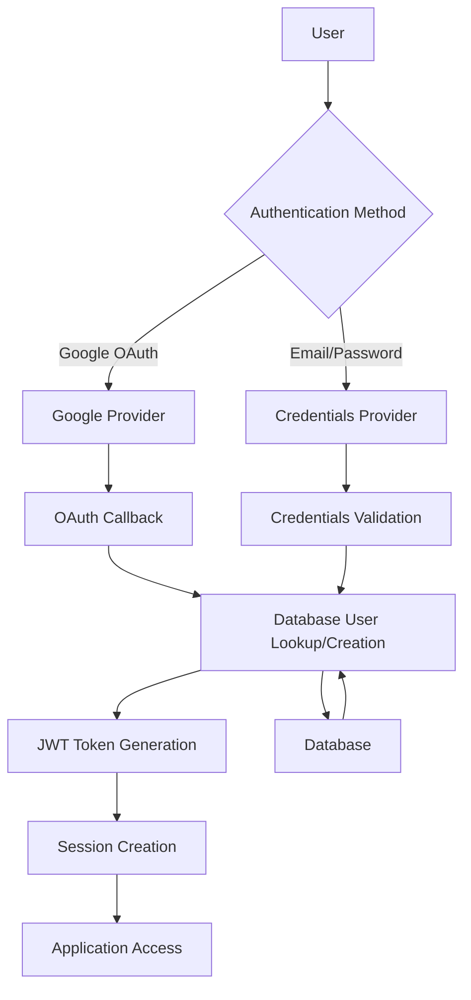

# OAuth + JWT Authentication Implementation Guide

## 🎯 Overview

This guide provides a **production-ready blueprint** for implementing mixed OAuth (Google) and JWT (email/password) authentication using NextAuth.js. Copy and adapt these patterns for any Next.js project requiring flexible authentication methods.

## 🏗️ Architecture Overview



## 📋 Prerequisites

- Next.js 14+ with App Router
- NextAuth.js v5
- PostgreSQL database
- Drizzle ORM (or similar)
- Google Cloud Console OAuth setup

## 🗄️ Database Schema

### User Table Structure
```sql
CREATE TABLE "User" (
    "id" uuid PRIMARY KEY DEFAULT gen_random_uuid(),
    "email" varchar(64) NOT NULL UNIQUE,
    "password" varchar(64),           -- Nullable for OAuth-only users
    "image" text,                     -- Profile image URL
    "customerId" varchar(64),
    "hasAccess" boolean DEFAULT false,
    "createdAt" timestamp DEFAULT now(),
    "updatedAt" timestamp DEFAULT now()
);
```

### Related Tables
```sql
-- Chat/Content table with proper foreign key
CREATE TABLE "Chat" (
    "id" uuid PRIMARY KEY DEFAULT gen_random_uuid(),
    "title" text NOT NULL,
    "userId" uuid NOT NULL REFERENCES "User"("id"),
    "createdAt" timestamp NOT NULL
);
```

## 🔐 Core Implementation Files

### 1. Database Queries (`lib/db/queries.ts`)

```typescript
import { drizzle } from 'drizzle-orm/postgres-js';
import { eq } from 'drizzle-orm';
import { user } from './schema';

// Get user by email (used by both OAuth and credentials)
export async function getUser(email: string) {
  return await db.select().from(user).where(eq(user.email, email));
}

// Create OAuth user (no password required)
export async function createUserOauth(userData: {
  email: string;
  name: string;
  image?: string;
  provider?: string;
  providerId?: string;
}) {
  const [newUser] = await db
    .insert(user)
    .values({
      email: userData.email,
      image: userData.image,
      createdAt: new Date(),
      updatedAt: new Date(),
    })
    .returning();
  
  return newUser;
}

// Update user profile (for image syncing)
export async function updateUser(userId: string, data: Partial<User>) {
  return await db.update(user).set(data).where(eq(user.id, userId));
}

// Create regular user with password
export async function createUser(email: string, password: string) {
  const salt = genSaltSync(10);
  const hash = hashSync(password, salt);
  
  return await db.insert(user).values({ email, password: hash });
}
```

### 2. NextAuth Configuration (`app/(auth)/auth.ts`)

```typescript
import NextAuth from 'next-auth';
import Credentials from 'next-auth/providers/credentials';
import GoogleProvider from 'next-auth/providers/google';
import { compare } from 'bcrypt-ts';
import { getUser, createUserOauth, updateUser } from '@/lib/db/queries';

export const { handlers: { GET, POST }, auth, signIn, signOut } = NextAuth({
  providers: [
    // Credentials Provider
    Credentials({
      credentials: {},
      async authorize({ email, password }: any) {
        const users = await getUser(email);
        if (users.length === 0) return null;
        
        const user = users[0];
        
        // 🔑 KEY: Reject OAuth-only users from credentials login
        if (!user.password) {
          console.log('User has no password (OAuth-only):', email);
          return null;
        }
        
        const passwordsMatch = await compare(password, user.password);
        if (!passwordsMatch) return null;
        return user;
      },
    }),
    
    // Google OAuth Provider
    GoogleProvider({
      clientId: process.env.GOOGLE_ID,
      clientSecret: process.env.GOOGLE_SECRET,
      authorization: {
        params: {
          prompt: "consent",
          access_type: "offline",
          response_type: "code"
        }
      }
    })
  ],
  
  callbacks: {
    // 🔑 KEY: Handle user creation and ID mapping
    async signIn({ user, account, profile }) {
      if (account?.provider === 'google') {
        try {
          const existingUsers = await getUser(user.email!);
          
          if (existingUsers.length === 0) {
            // Create new user
            const newUser = await createUserOauth({
              email: user.email!,
              name: user.name!,
              image: user.image,
              provider: 'google',
              providerId: user.id
            });
            user.id = newUser.id; // 🔑 Use database ID
          } else {
            // Update existing user's image if changed
            const existingUser = existingUsers[0];
            if (existingUser.image !== user.image && user.image) {
              await updateUser(existingUser.id, { image: user.image });
            }
            user.id = existingUser.id; // 🔑 Use database ID
          }
          
          return true;
        } catch (error) {
          console.error('Error during Google sign in:', error);
          return false;
        }
      }
      
      return true;
    },
    
    // 🔑 KEY: Handle different auth methods in JWT
    async jwt({ token, user, account }) {
      if (user) {
        token.id = user.id;
        token.email = user.email;
        
        if (account?.provider === 'google') {
          // OAuth: use provider data
          token.image = user.image;
          token.name = user.name;
        } else {
          // Credentials: fetch from database
          const [dbUser] = await getUser(user.email!);
          if (dbUser) {
            token.image = dbUser.image;
            token.name = user.name || user.email!.split('@')[0];
          }
        }
      }
      return token;
    },
    
    // 🔑 KEY: Complete session with all user data
    async session({ session, token }) {
      if (session.user) {
        session.user.id = token.id as string;
        session.user.image = token.image as string;
        session.user.name = token.name as string;
      }
      return session;
    },
  },
});
```

### 3. Server Actions (`app/(auth)/actions.ts`)

```typescript
'use server';

import { z } from 'zod';
import { signIn } from './auth';
import { getUser } from '@/lib/db/queries';

const authFormSchema = z.object({
  email: z.string().email(),
  password: z.string().min(6),
});

export interface LoginActionState {
  status: 'idle' | 'in_progress' | 'success' | 'failed' | 'invalid_data' | 'oauth_only';
}

export const login = async (
  _: LoginActionState,
  formData: FormData,
): Promise<LoginActionState> => {
  try {
    const validatedData = authFormSchema.parse({
      email: formData.get('email'),
      password: formData.get('password'),
    });

    // 🔑 KEY: Check for OAuth-only users before sign-in attempt
    const users = await getUser(validatedData.email);
    if (users.length > 0 && !users[0].password) {
      return { status: 'oauth_only' };
    }

    await signIn('credentials', {
      email: validatedData.email,
      password: validatedData.password,
      redirect: false,
    });

    return { status: 'success' };
  } catch (error) {
    if (error instanceof z.ZodError) {
      return { status: 'invalid_data' };
    }
    return { status: 'failed' };
  }
};
```

### 4. Login Page Component (`app/(auth)/login/page.tsx`)

```typescript
'use client';

import { useActionState, useEffect, useState } from 'react';
import { useRouter, useSearchParams } from 'next/navigation';
import { signIn } from 'next-auth/react';
import { toast } from '@/components/toast';
import { login, type LoginActionState } from '../actions';

export default function LoginPage() {
  const router = useRouter();
  const searchParams = useSearchParams();
  const [state, formAction] = useActionState<LoginActionState, FormData>(login, {
    status: 'idle',
  });

  // 🔑 KEY: Handle OAuth errors from URL
  useEffect(() => {
    const error = searchParams.get('error');
    if (error) {
      let errorMessage = 'Authentication error occurred';
      
      if (error === 'AccessDenied') {
        errorMessage = 'Access denied. Please try signing in again.';
      } else if (error === 'Configuration') {
        errorMessage = 'Authentication configuration error. Please contact support.';
      }
      
      toast({ type: 'error', description: errorMessage });
    }
  }, [searchParams]);

  // 🔑 KEY: Handle form state responses
  useEffect(() => {
    if (state.status === 'oauth_only') {
      toast({
        type: 'error',
        description: 'This email is linked to Google. Please use "Continue with Google" or register with a different email.',
      });
    } else if (state.status === 'failed') {
      toast({ type: 'error', description: 'Invalid credentials!' });
    } else if (state.status === 'success') {
      router.refresh();
    }
  }, [state.status, router]);

  // 🔑 KEY: Clear state when switching to OAuth
  const handleGoogleSignIn = async (e: React.MouseEvent) => {
    e.preventDefault();
    try {
      window.history.replaceState({}, '', '/login');
      await signIn('google', { callbackUrl: '/' });
    } catch (error) {
      toast({
        type: 'error',
        description: 'Failed to sign in with Google. Please try again.',
      });
    }
  };

  return (
    <div className="auth-container">
      {/* Google OAuth Button */}
      <button onClick={handleGoogleSignIn}>
        Continue with Google
      </button>
      
      {/* Email/Password Form */}
      <form action={formAction}>
        <input name="email" type="email" required />
        <input name="password" type="password" required />
        <button type="submit">Sign In</button>
      </form>
    </div>
  );
}
```

### 5. Middleware Configuration (`middleware.ts`)

```typescript
import NextAuth from 'next-auth';
import { authConfig } from '@/app/(auth)/auth.config';

export default NextAuth(authConfig).auth;

export const config = {
  matcher: [
    /*
     * 🔑 KEY: Exclude NextAuth API routes from middleware
     * This prevents OAuth flow from being blocked
     */
    '/((?!api/auth|_next/static|_next/image|favicon.ico).*)',
  ],
};
```

### 6. Auth Config (`app/(auth)/auth.config.ts`)

```typescript
import type { NextAuthConfig } from 'next-auth';

export const authConfig = {
  pages: {
    signIn: '/login',
    newUser: '/',
    error: '/login',
  },
  providers: [],
  callbacks: {
    authorized({ auth, request: { nextUrl } }) {
      const isLoggedIn = !!auth?.user;
      const isOnAuth = nextUrl.pathname.startsWith('/api/auth');

      // 🔑 KEY: Always allow NextAuth API routes
      if (isOnAuth) {
        return true;
      }

      // Your authorization logic here
      if (nextUrl.pathname.startsWith('/protected')) {
        return isLoggedIn;
      }

      return true;
    },
  },
} satisfies NextAuthConfig;
```

## 🌍 Environment Variables

```env
# NextAuth Configuration
NEXTAUTH_URL=http://localhost:3000
AUTH_SECRET=your-secret-key

# Google OAuth Credentials
GOOGLE_ID=your-google-client-id
GOOGLE_SECRET=your-google-client-secret

# Database
DATABASE_URL=your-database-url
```

## 🎯 Implementation Checklist

### Database Setup
- [ ] Create User table with nullable password field
- [ ] Add image field for profile pictures
- [ ] Set up proper foreign key relationships
- [ ] Create database query functions

### NextAuth Setup
- [ ] Configure Google OAuth provider
- [ ] Implement credentials provider with OAuth-only user check
- [ ] Set up signIn callback for user creation/mapping
- [ ] Configure JWT callback for different auth methods
- [ ] Set up session callback for complete user data

### Authentication Flow
- [ ] Create login page with both OAuth and credentials options
- [ ] Implement server actions with OAuth-only user detection
- [ ] Add proper error handling and user feedback
- [ ] Configure middleware to allow OAuth API routes

### User Experience
- [ ] Add user-friendly error messages
- [ ] Implement image syncing between auth methods
- [ ] Handle state management between OAuth and credentials
- [ ] Add proper loading and success states

## 🚀 Usage Patterns

### For New Projects
1. Copy the database schema
2. Implement the query functions
3. Set up NextAuth configuration
4. Create login/register pages
5. Configure middleware
6. Add environment variables

### For Existing Projects
1. Migrate existing user table to include image field
2. Update authentication logic to handle OAuth-only users
3. Add image syncing capabilities
4. Update UI to handle mixed authentication flows

## 🛡️ Security Considerations

- **Password Validation**: OAuth-only users cannot use credentials login
- **Database Integrity**: Proper foreign key relationships maintained
- **Session Security**: Complete user data in sessions without exposing sensitive info
- **Error Handling**: Graceful degradation and user-friendly messages
- **Image Updates**: Safe profile image syncing with error handling

## 📊 Benefits

- **Flexible Authentication**: Users can choose their preferred method
- **Seamless Experience**: Consistent user data across auth methods
- **Data Integrity**: Proper database relationships and user mapping
- **User Retention**: Clear guidance for users with multiple auth methods
- **Production Ready**: Comprehensive error handling and edge cases covered

## 🔗 Resources

- [NextAuth.js Documentation](https://next-auth.js.org/)
- [Google OAuth Setup](https://developers.google.com/identity/protocols/oauth2)
- [Drizzle ORM](https://orm.drizzle.team/)
- [Next.js App Router](https://nextjs.org/docs/app)

---

**Implementation Guide**  
**Version:** 1.0  
**Last Updated:** December 2024  
**Status:** ✅ Production Tested